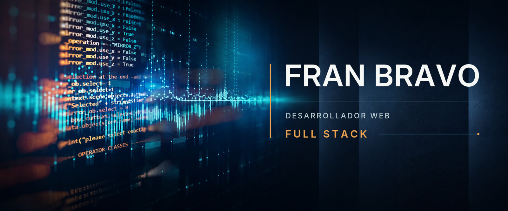

  

# Hola, soy Fran

Soy **desarrollador web full stack**, con especial interés profesional en backend, producto y lógica de negocio.

Trabajo principalmente con **Python, Django, React, SQL y PostgreSQL** para construir aplicaciones web completas, mantenibles y orientadas a resolver necesidades reales. Me interesa participar en todo el proceso de desarrollo: análisis del problema, modelado de datos, implementación, pruebas, despliegue y documentación.

También incorporo herramientas de inteligencia artificial y flujos agénticos a mi forma de trabajar. Utilizo especialmente tecnologías de OpenAI y Codex para analizar requisitos, explorar alternativas, implementar, revisar, probar y documentar software, manteniendo siempre bajo mi responsabilidad las decisiones técnicas y la validación final.

Actualmente estoy finalizando el **Máster en Desarrollo Web Full Stack de Conquer Blocks**. Mi Proyecto Fin de Máster se encuentra desarrollado, publicado y pendiente de evaluación.

## Proyecto principal

### [AgendaSalon](https://github.com/fjbravo75/agendasalon)

AgendaSalon es una aplicación web para gestionar citas, clientes, profesionales y reservas online en peluquerías, barberías y pequeños salones de belleza.

El proyecto nace como entregable técnico de mi Proyecto Fin de Máster, pero ha sido concebido como un producto web completo. Reúne en un mismo sistema la agenda de los profesionales, la operativa interna del negocio, la reserva pública de citas y la administración funcional de la plataforma.

Su núcleo está construido con **Django y PostgreSQL**. React se utiliza en interfaces concretas en las que aporta una experiencia más dinámica e interactiva, mientras que Django mantiene la lógica de negocio, los permisos, la seguridad y las operaciones críticas.

Entre sus principales funcionalidades se encuentran:

- agenda diaria y mensual para profesionales;
- creación asistida, modificación y seguimiento de citas;
- reserva online con comprobación de disponibilidad;
- gestión de clientes, profesionales, servicios, horarios y cierres;
- aislamiento de datos y permisos por negocio;
- administración funcional de la plataforma;
- autenticación, recuperación de acceso y verificación de correo;
- pruebas automatizadas e integración continua con GitHub Actions;
- despliegue en producción con PostgreSQL, Gunicorn, Nginx y HTTPS.

**[Ver el repositorio](https://github.com/fjbravo75/agendasalon)** ·
**[Abrir la demostración](https://agendasalon.brvsoftwarestudio.com)**

## Otros proyectos

### [Django Task Manager](https://github.com/fjbravo75/django-task-manager)

Aplicación web de gestión de tareas tipo kanban desarrollada con Django.

Permite organizar el trabajo mediante tableros, listas y tareas, modificar su estado y moverlas entre diferentes áreas de trabajo. Incluye una interfaz interactiva, control de acceso, pruebas automatizadas y una demostración pública desplegada.

`Django` · `JavaScript` · `HTML` · `CSS`

**[Ver el repositorio](https://github.com/fjbravo75/django-task-manager)** ·
**[Abrir la demostración](https://task.franciscojbravo.com)**

### [CRM Básico Django](https://github.com/fjbravo75/crm-basico-django)

Aplicación web para gestionar clientes y actividad comercial.

El proyecto implementa operaciones CRUD, relaciones entre modelos, control de acceso, seguimiento de actividad y flujos habituales de una herramienta interna de negocio.

`Django` · `Python` · `SQL` · `HTML` · `CSS`

**[Ver el repositorio](https://github.com/fjbravo75/crm-basico-django)** ·
**[Abrir la demostración](https://crm.franciscojbravo.com)**

### [React CatGallery](https://github.com/fjbravo75/react-02-catgallery)

Aplicación frontend desarrollada con React y publicada en GitHub Pages.

Forma parte de mi evolución práctica en componentes, gestión de estado, consumo de datos e interfaces interactivas.

`React` · `Vite` · `JavaScript` · `CSS`

**[Ver el repositorio](https://github.com/fjbravo75/react-02-catgallery)**

### [Python SQL Library Manager](https://github.com/fjbravo75/python-sql-library-manager)

Gestor de biblioteca desarrollado con Python y SQLite.

Incluye búsquedas, creación y edición de registros, control de disponibilidad y persistencia de datos. El proyecto muestra mi base de programación, organización de lógica y manejo de bases de datos fuera del entorno Django.

`Python` · `SQL` · `SQLite`

**[Ver el repositorio](https://github.com/fjbravo75/python-sql-library-manager)**

## Tecnologías

### Backend y datos

- Python
- Django
- SQL
- PostgreSQL
- SQLite

### Frontend

- HTML
- CSS
- JavaScript
- React
- Vite
- htmx

### Calidad, infraestructura y despliegue

- Git y GitHub
- pruebas automatizadas
- integración continua con GitHub Actions
- Linux y terminal
- Gunicorn
- Nginx
- DigitalOcean
- HTTPS
- configuración de entornos y variables de entorno

## Desarrollo asistido por inteligencia artificial

He incorporado la inteligencia artificial y los agentes de desarrollo a mi flujo habitual de trabajo.

Utilizo principalmente herramientas de OpenAI y Codex para:

- analizar requisitos y convertirlos en tareas ejecutables;
- explorar alternativas técnicas antes de implementar;
- trabajar con el contexto completo de un repositorio;
- planificar y dividir trabajos complejos;
- acelerar tareas de implementación, refactorización y depuración;
- generar, ejecutar y revisar pruebas;
- detectar inconsistencias entre código, producto y documentación;
- documentar decisiones y mantener la trazabilidad del proyecto.

No considero la salida de una herramienta de inteligencia artificial como trabajo terminado. Reviso los cambios, ejecuto pruebas y compruebo su comportamiento antes de integrarlos.

La arquitectura, el alcance, la seguridad y la validación final continúan siendo responsabilidad del desarrollador. Entiendo la inteligencia artificial como una herramienta para ampliar la capacidad de análisis y ejecución, no como un sustituto del conocimiento técnico.

## Cómo trabajo

Me interesa comprender primero el problema, identificar las necesidades reales y modelar correctamente los datos antes de desarrollar una solución.

Construyo los proyectos de forma progresiva, procurando que cada decisión técnica tenga una finalidad clara dentro del producto.

Valoro especialmente:

- el código claro, comprensible y mantenible;
- la lógica de negocio bien definida;
- el modelado coherente de los datos;
- las validaciones, los permisos y la seguridad;
- las pruebas como parte del proceso de desarrollo;
- la documentación útil y actualizada;
- la coherencia entre producto, código y experiencia de usuario;
- el uso responsable de las herramientas de inteligencia artificial.

Busco que cada proyecto pueda entenderse, ejecutarse, comprobarse, mantenerse y explicarse, no solo que funcione en mi propio entorno.

## Objetivo profesional

Quiero incorporarme a un equipo de desarrollo web donde pueda seguir creciendo como desarrollador full stack, aportar una base sólida de backend y participar en la construcción de productos reales de principio a fin.

Me interesan especialmente los proyectos desarrollados con Python, Django, JavaScript, React, SQL y PostgreSQL, así como los equipos que combinan buenas prácticas de ingeniería con herramientas modernas de desarrollo asistido por inteligencia artificial, utilizadas con criterio, supervisión y responsabilidad técnica.

## Contacto

Estoy abierto a oportunidades profesionales, colaboraciones y proyectos relacionados con el desarrollo web full stack.

- **Correo electrónico:** [fjbravo75@hotmail.com](mailto:fjbravo75@hotmail.com)
- **LinkedIn:** [linkedin.com/in/francisco-jose-bravo-manzanares](https://www.linkedin.com/in/francisco-jose-bravo-manzanares/)
